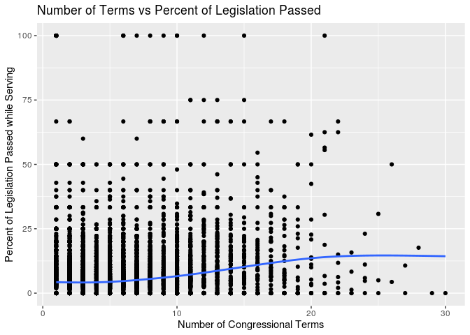

<!-- README.md is generated from README.Rmd. Please edit that file -->

# Congress

<!-- badges: start -->

<!-- badges: end -->

The goal of Congress is to …

## Installation

You can install the released version of Congress from
[CRAN](https://CRAN.R-project.org) with:

``` r
install.packages("Congress")
```

## Example

This is a graph of the number of terms vs percent of legislation passed
for representatives in the US Congress.

``` r
library(Congress)
library(ggplot2)
Congress <- readRDS(file = "data.Rds")

ggplot(Congress,
  aes(x = number_terms, y = pass_prcnt)) +
  geom_point() + 
  geom_smooth(se = FALSE) + 
  labs(title = "Number of Terms vs Percent of Legislation Passed", 
       x = "Number of Congressional Terms", 
       y = "Percent of Legislation Passed while Serving")
#> `geom_smooth()` using method = 'gam' and formula 'y ~ s(x, bs = "cs")'
#> Warning: Removed 157 rows containing non-finite values (stat_smooth).
#> Warning: Removed 157 rows containing missing values (geom_point).
```


